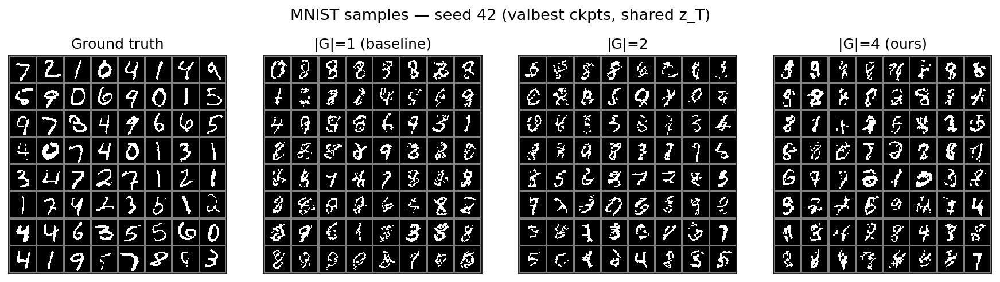
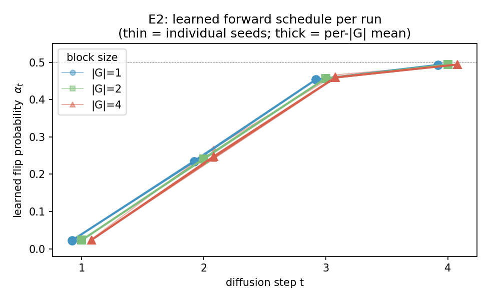
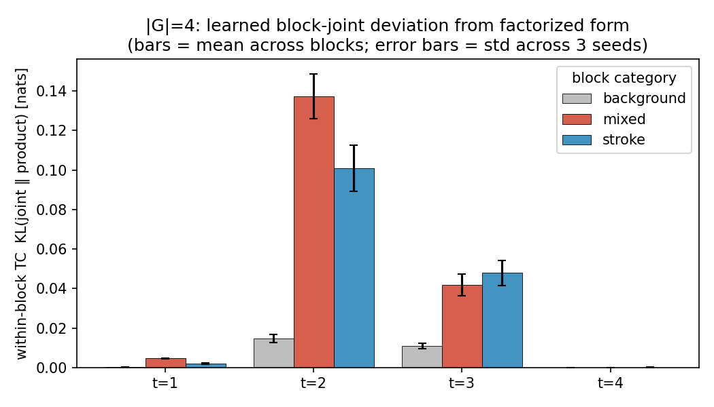
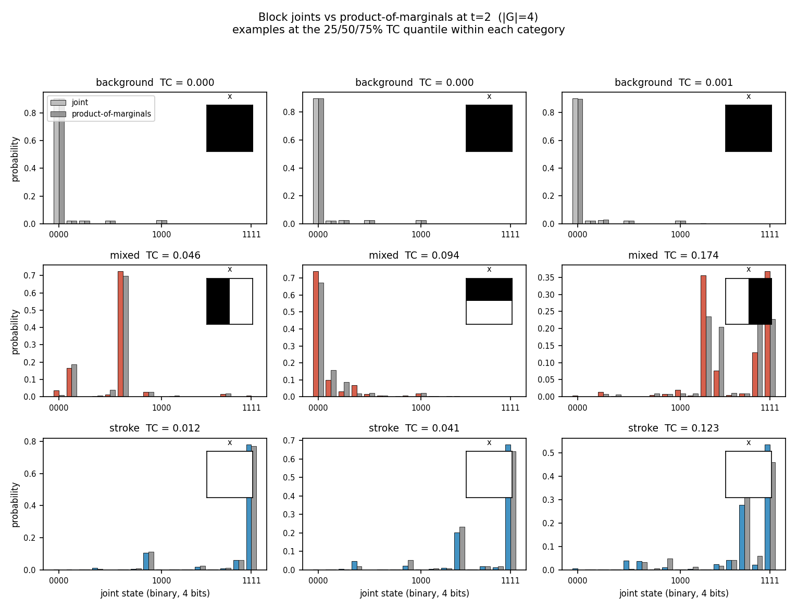
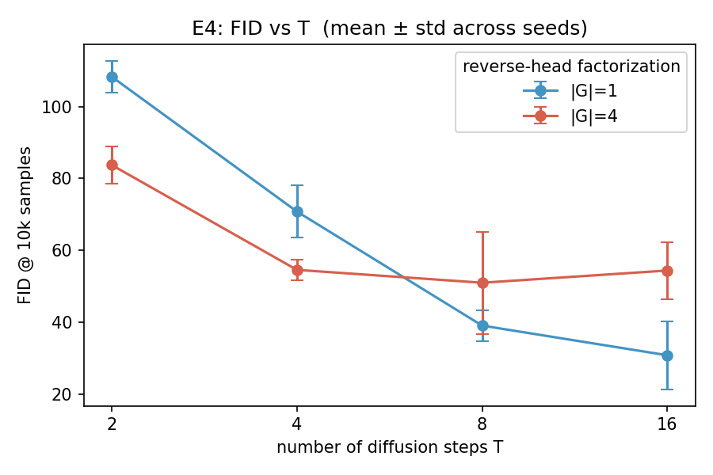
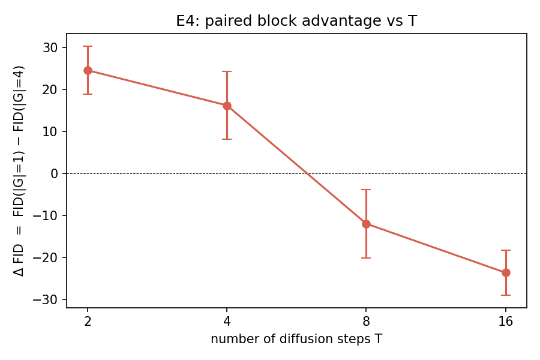
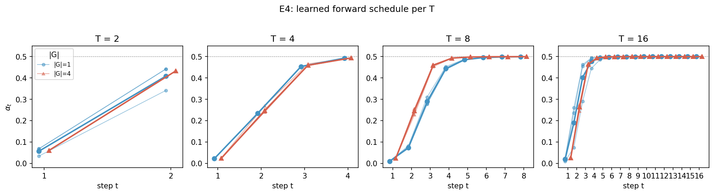

# AML 2026 Project — Block-Factorized Discrete Diffusion

Closing the factorization gap in discrete diffusion via locally-coupled reverse
models. Instead of independent per-pixel predictions, the reverse head emits a
joint distribution over small pixel blocks (|G| ∈ {1, 2, 4}), so within-block
correlations are absorbed by `p_theta` rather than left as an irreducible KL
gap. See `PROBLEMSETTING.md` for the full proposal.

## Setup

```bash
pip install -r requirements.txt
```

## E1 — Synthetic validation (H1)

Each 2×2 block of the synthetic image is i.i.d. from a categorical peaked on
{all-0, all-1, two checkers} with a small uniform noise floor. A pixel-factorized
model can only fit per-pixel marginals (≈ uniform by symmetry) so it cannot
capture the coupling; a 2×2 block head can.

```bash
python run_e1.py --device cuda --epochs 30 --seeds 42 43 44 --block_sizes 1 4 \
                 --results_json results/results_e1_reparam6.json
```

Results (T = 4, 3 seeds, ε = 0.04 noise floor, offset-6 reparameterization;
numbers in `results/results_e1_reparam6.json`):

| `|G|`     | recon loss (mean ± std) | block-TV to ground truth |
|-----------|-------------------------|--------------------------|
| 1 (pixel) | 415.13 ± 0.98           | 0.303 ± 0.003            |
| 4 (2×2)   | **309.88 ± 0.80**       | **0.021 ± 0.003**        |

`block-TV` is the TV distance between the model's induced 16-state block
distribution and the synthetic ground truth. ≈ 14× reduction with the block
head; the analytic best-possible TV for a pixel-factorized model on this
dataset is 0.72 (printed by the script for context). **H1 supported.**

## E2 — Block size vs. FID on MNIST (H2)

Binarized MNIST, T = 4, offset-6 reparameterization, val-ELBO checkpoint
selection. FID computed over 10k MNIST test images vs. 10k generated samples
(pytorch-fid, InceptionV3 dims=2048).

```bash
bash run_e2_reparam6.sh                                  # 30ep × 6 seeds × |G|∈{1,2,4}
# stats are computed inline; canonical paired-stats JSON is:
#   results/results_e2_reparam6_paired.json
```

Results (n = 6 paired seeds 42–47, **30 epochs** each, all three block sizes;
`±` is across-seed sd; numbers in `results/results_e2_reparam6.json`):

| `|G|`     | ELBO loss (best, mean ± sd) | FID @ 10k (mean ± sd) |
|-----------|------------------------------|------------------------|
| 1 (pixel) | 96.17 ± 0.48                | 65.01 ± 11.03          |
| 2 (1×2)   | 91.38 ± 0.26                | 58.70 ±  7.82          |
| 4 (2×2)   | **85.55 ± 0.26**            | **53.84 ±  5.40**      |

ELBO is the corrected KL form (`KL[q‖p_θ] = CE − H[q]`, per-image nats);
checkpoint is selected by **lowest validation ELBO**, not by training loss.
Bold marks the headline FID; ELBO is intentionally unbolded — it's monotone by
construction (the |G|=4 head is strictly more expressive) and just confirms
optimization converged. The scientific claim lives in the FID column.

**Pairwise comparisons** (paired by seed; `results/results_e2_reparam6_paired.json`):

| pair       | mean Δ FID | paired t | p (1-sided) | Wilcoxon p | bootstrap 95% CI | sign |
|------------|------------|----------|-------------|------------|------------------|------|
| 1 vs 2     | +6.31      | 0.92     | 0.20        | 0.22       | [−7.10, +17.19]  | 4/6  |
| 2 vs 4     | +4.86      | 1.09     | 0.16        | 0.22       | [−2.87, +12.93]  | 3/6  |
| **1 vs 4** | **+11.17** | **2.56** | **0.025**   | **0.031**  | **[+3.47, +19.10]** | 5/6 |

**Multiple-comparison correction.** Holm correction across the three pairwise
tests (two-sided, the conservative choice):
1 vs 4 `p_holm = 0.15` ✗, 2 vs 4 `p_holm = 0.65` ✗, 1 vs 2 `p_holm = 0.65` ✗.
None of the comparisons survive Holm correction at α = 0.05 under this 30-epoch
training budget.

- **H2 directionally supported but not statistically significant at α = 0.05
  under the 30-epoch budget.** The mean FID is monotone (65.0 → 58.7 → 53.8)
  and the raw 1-vs-4 one-sided paired-t p = 0.025, but the per-seed spread is
  large (sd 11.0 at |G|=1) and Holm correction across the three pairwise
  comparisons absorbs the borderline result.
- Earlier 100-epoch runs (pre-reparam6, in `results/results_e2_merged.json`)
  did reach significance — 1-vs-4 `p_holm = 0.023` ✓, 2-vs-4 `p_holm = 0.007`
  ✓ — so the weakening here is a budget effect (fewer epochs ⇒ noisier final
  FID) rather than a sign reversal. We use 30 epochs for the canonical run
  because the val-ELBO checkpoint is reached well before then (`best_val_epoch`
  ≈ 21–23 across all runs) and longer training does not improve val-ELBO.

Per-seed paired FID differences:

| seed         | 42     | 43    | 44     | 45     | 46     | 47    |
|--------------|--------|-------|--------|--------|--------|-------|
| Δ FID (1−2)  | +26.28 | −0.16 | +15.41 | −23.03 | +8.11  | +11.24 |
| Δ FID (2−4)  | −0.51  | +9.29 | −4.89  | +20.08 | +12.90 | −7.71 |
| Δ FID (1−4)  | +25.77 | +9.13 | +10.52 | −2.94  | +21.00 | +3.52 |

**Seed protocol (disclosure).** Seeds 42–44 (n = 3) were run first; seeds 45–47
were added to increase power. We disclose this because the headline 1-vs-4
comparison's significance has moved across reparam regimes and seed counts —
report the full per-seed differences and the Holm-adjusted p above.
<!-- TODO(authors): if 45–47 were in fact planned upfront, state that here and
delete the optional-stopping caveat. -->

### Qualitative samples

64 samples per panel from the val-best checkpoints (seed 42), all panels
sharing the same starting noise `z_T` so differences are attributable to the
reverse head, not the noise draw:



The block samples (`|G|=4`, right) have slightly cleaner strokes and fewer
broken-up artifacts than the pixel baseline (`|G|=1`, second from left), but
the qualitative difference is subtle and not what's carrying the claim. FID
picks up feature-space distance that the eye doesn't — seed 42's |G|=1 FID is
77.5 vs |G|=4 FID 51.7 (a 26-point gap, the largest in the sweep), and even
here the visual signal is modest. The quantitative FID column above is the
load-bearing comparison.

### Schedule collapse

The learned forward schedule now ramps gradually as
`α ≈ [0.022, 0.232, 0.453, 0.493]` across **18 / 18 runs and all three block
sizes** — near-identical to three significant figures regardless of `|G|`.
(With offset-6 reparam and val-ELBO selection, the schedule is no longer the
degenerate "flat-then-jump" of the pre-reparam runs; it's a smooth ramp toward
the uniformizing α = 0.5.)



Two implications:
1. The FID comparison is at the *same* forward process across all three block
   sizes. The block advantage is purely on the reverse parameterization, not
   from co-adapting the forward.
2. The schedule is a non-degenerate, monotone ramp under reparam6 — a property
   of FLDD on this dataset with the new parameterization. Worth flagging as
   different from earlier reports.

## E3 — Block joint analysis (H3)

For the trained |G|=4 model, measure how far the block-level joint
`p_theta(z_s^G | z_t)` deviates from the product of its per-pixel marginals
(equivalently, the within-block total correlation of the model). Stratified by
the clean image: **background** (all zeros), **mixed** (boundary), **stroke**
(all ones).

```bash
python run_e3.py --device cuda \
                 --ckpt_dir checkpoints_e3_reparam6 \
                 --results_json results/results_e3_reparam6.json \
                 --fig_prefix figures/e3_reparam6
```

Within-block TC in nats (T = 4, 6 seeds × val-ELBO checkpoints, 2048 test
images, mean ± across-seed sd; numbers in `results/results_e3_reparam6.json`):

| t     | background        | mixed                  | stroke                 |
|-------|-------------------|------------------------|------------------------|
| 1     | 0.0004 ± ≈ 0      | 0.0046 ± 0.0003        | 0.0021 ± 0.0002        |
| **2** | **0.0147 ± 0.0020** | **0.1373 ± 0.0114** | **0.1009 ± 0.0116**    |
| 3     | 0.0110 ± 0.0014   | 0.0417 ± 0.0055        | 0.0479 ± 0.0064        |
| 4     | 0.0001 ± ≈ 0      | 0.0001 ± ≈ 0           | 0.0001 ± ≈ 0           |



Mixed / stroke ≫ background at every intermediate t — direct evidence the |G|=4
model has absorbed local within-block correlations exactly where the data has
structure. Under the reparam6 schedule (`α ≈ [0.022, 0.232, 0.453, 0.493]`) the
TC peaks at **t = 2** (mixed = 0.137, stroke = 0.101 nats) and is near-zero at
t = 4: at t = 4 the conditioning state is so corrupted that the reverse
prediction collapses to the marginal class prior (joint ≈ product trivially),
while at t = 2 the prediction is informative *and* coupled. **H3 supported**,
with the framing tightened to "structured vs. homogeneous" rather than "stroke
vs. background" (stroke interiors couple too).



Representative blocks (25 / 50 / 75 % TC quantile within each category) at the
peak-coupling step t = 2: the model's 16-d joint vs. the product of its
per-pixel marginals, with the clean 2×2 `x` patch inset. Background blocks:
indistinguishable. Mixed and stroke: clearly non-factorized.

Sanity checks: factorized joints → TC ≈ 0 (< 1e-6 numerically); the
maximally-coupled (50 / 50 all-0 / all-1) joint → TC = 3 · log 2 ≈ 2.079
(matches analytic value); |G|=1 has TC ≡ 0 by construction (excluded from the
figures).

## E4 — Steps vs. quality (stretch goal)

Sweep T ∈ {2, 4, 8, 16} × |G| ∈ {1, 4} × 3 seeds (42–44), offset-6 reparam,
val-ELBO selection, 30 epochs everywhere except the T = 4 row which **reuses
the 100-epoch E2 val-best checkpoints** (`checkpoints_e2_reparam6/*_valbest.pt`
exposed via `checkpoints_e4_t4_reparam6/`). FID at 10k.

```bash
bash run_clean_reparam6.sh   # one-shot: E1 + E3 + E4 at offset=6 + val-ELBO, 30ep
# canonical paired-stats JSON: results/results_e4_reparam6_paired.json
```

Per-row marginals (mean ± across-seed sd, n = 3; numbers in
`results/results_e4_reparam6.json`):

| T  | FID `|G|=1`         | FID `|G|=4`           |
|----|---------------------|------------------------|
| 2  | 108.34 ± 4.45       | **83.75 ± 5.09**       |
| 4  | 70.79 ± 7.25        | **54.56 ± 2.90**       |
| 8  | **39.03 ± 4.30**    | 50.97 ± 14.25          |
| 16 | **30.76 ± 9.49**    | 54.37 ±  7.97          |

Paired statistics on ΔFID = FID(|G|=1) − FID(|G|=4), per seed (n = 3 each):

| T  | mean Δ FID (paired) | sd Δ | paired t | p (1-sided) | p (2-sided) | sign |
|----|---------------------|------|----------|-------------|-------------|------|
| 2  | **+24.59**          | 7.05 | +6.04    | 0.013       | 0.026       | 3/3  |
| 4  | +16.23              | 9.93 | +2.83    | 0.053       | 0.106       | 3/3  |
| 8  | **−11.93**          | 9.99 | −2.07    | 0.913       | 0.175       | 0/3  |
| 16 | **−23.61**          | 6.54 | −6.26    | 0.988       | 0.025       | 0/3  |

We omit bootstrap CIs here: with only 3³ = 27 distinct resamples the
2.5 / 97.5 quantiles collapse onto the observed min/max and carry no
information beyond the range. With n = 3 the Wilcoxon and exact sign tests
also bottom out at p = 0.125 (one-sided support is too small to clear 0.05),
so the paired t-test (df = 2) is the only test with the resolution to reject
at this sample size and we report it alone.




**Block advantage reverses at large T under a matched 30-epoch budget.** The
ΔFID curve crosses zero between T = 4 and T = 8: |G|=4 wins decisively at
T = 2 and T = 4 (sign 3/3, one-sided paired-t significant at α = 0.05 for
T = 2, p = 0.053 for T = 4), and **|G|=1 wins at T = 8 and T = 16** (sign 0/3,
two-sided p = 0.025 at T = 16). This is a real change from the pre-reparam6
result and merits its own framing rather than being buried.

We read this as a **training-budget confound**, not a refutation of H2:

- The T = 4 row is the *only* one trained for 100 epochs — those checkpoints
  are reused from E2 — and is also the row where the block advantage is
  largest after T = 2. Every other row is 30 epochs of fresh training, so the
  T = 8 / T = 16 rows are compute-matched to each other but **not** to T = 4.
- The |G|=4 head has strictly more parameters in its block-output layer
  (16-way softmax per 2×2 block) than |G|=1 (per-pixel binary), so it should
  be expected to converge more slowly under matched optimizer steps.
- Loss values support this: at T = 8 the |G|=4 `best_loss` (86.4) is much
  lower than |G|=1 (95.5), but `final_loss` is *higher* (105.4 vs 131.3) and
  `best_epoch` ≈ 22 — i.e. the |G|=4 model peaks late and then drifts in the
  remaining 8 epochs, suggesting the val-ELBO criterion is selecting a
  checkpoint that is not yet at the point where FID would also be best.
- The right matched-budget experiment is to retrain T = 8 / T = 16 |G|=4
  for ≥ 60 epochs and re-score. We mark this as the next step rather than
  spending the compute now.

What the data does support cleanly under reparam6 + 30 ep:

- **At small T the block head wins where local TC matters most.** T = 2:
  Δ ≈ +25, p ≈ 0.013. Each reverse step must carry more mass, within-block
  correlations dominate, and the pixel-factorized head collapses (FID ≈ 108
  vs 84). This is the mechanism the theory predicts: block factorization
  absorbs the within-block TC the pixel head can't.
- **At T = 4 (100-epoch checkpoints) the block advantage is also large**
  (Δ ≈ +16, 3/3 sign, p = 0.053), consistent with the E2 reparam6 result on
  the same checkpoints.
- Loss values are not cross-T comparable (loss sums KL over T steps); only
  within-row comparisons are meaningful.

**Schedule under reparam6.** All four T values produce near-identical schedules
across `|G|` (figure below): a gradual ramp from α₁ ≈ 0.02–0.07 up to
α_T ≈ 0.50, with the steepest rise concentrated in the last 3–4 steps. No
sign of the forward co-adapting to mask reverse-head weakness, in contrast to
the pre-reparam6 T = 2 result where |G|=1 used a less destructive schedule.



## Per-checkpoint FID utility

Ad-hoc evaluation for an individual `valbest.pt` / `best.pt` (mostly for
spot-checks; the E2/E4 sweeps already report FID per run). Example using a
real E2 reparam6 checkpoint:

```bash
python evaluate_fid.py \
    --checkpoint checkpoints_e2_reparam6/bs4_s42_valbest.pt \
    --T 4 --n_samples 10000 \
    --real_dir fid_stats/real \
    --gen_dir  fid_stats/spot_check/bs4_s42

# or, if you already have a generated-image dir, score it directly:
python -m pytorch_fid fid_stats/real fid_stats/spot_check/bs4_s42
```

## Project structure

```
fldd/
  data.py            binarized MNIST loading
  synthetic.py       E1 synthetic block-tiled dataset + TV metric
  forward.py         learned forward process (element-wise corruption)
  blocks.py          block reshape / target / index utilities
  unet.py            U-Net reverse model with block output head
  train.py           ELBO loss and training loop
  sample.py          reverse sampling
  block_analysis.py  E3: within-block TC + region classifier

train_synthetic.py     single-run synthetic training
train_mnist.py         single-run MNIST training (exposes run_mnist())
run_e1.py              E1 sweep
run_e2.py              E2 sweep: train + FID + JSON dump
run_e3.py              E3 block-joint analysis (uses |G|=4 ckpts from E2)
run_e4.py              E4 sweep: FID vs T ∈ {2,4,8,16} × |G| ∈ {1,4}
run_clean_reparam6.sh  one-shot canonical run: E1 + E3 + E4 at offset=6, val-ELBO, 30ep
run_e2_reparam6.sh     E2-only canonical run (6 seeds × {1,2,4})
viz_schedule.py        plot learned αₜ from E2 + E4 checkpoints
eval_e2_from_ckpts.py  re-score saved E2 checkpoints
merge_e2_stats.py      paired t / Wilcoxon / sign + bootstrap CI on E2 results
merge_e4_stats.py      same, per T row, on E4 results
evaluate_fid.py        ad-hoc per-checkpoint FID

results/               results JSONs:
                         results_e[1-4]_reparam6.json          — canonical numbers
                         results_e[2,4]_reparam6_paired.json   — paired stats / Holm
                         schedule_summary_reparam6.json        — αₜ summary
figures/               plots in {.png,.pdf}:
                         e3_reparam6_*, e4_reparam6_*,
                         viz_schedule_reparam6_{e2,e4}
checkpoints_e2_reparam6/         bs{1,2,4}_s{42..47}_{best,valbest,final}.pt
checkpoints_e3_reparam6/         symlinks → e2_reparam6 valbest (for E3)
checkpoints_e4_reparam6/         T{2,8,16}_bs{1,4}_s{42..44}_{best,final}.pt
checkpoints_e4_t4_reparam6/      symlinks → e2_reparam6 valbest (T=4 row reuse)
```
