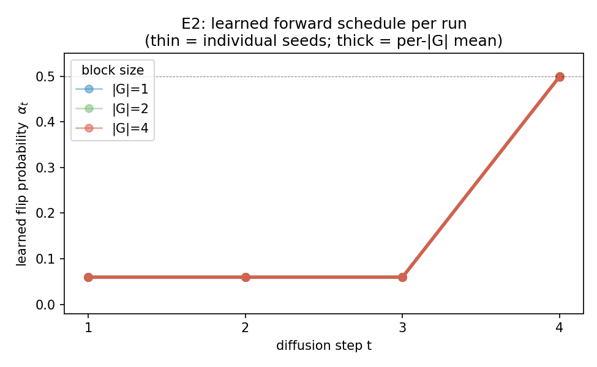
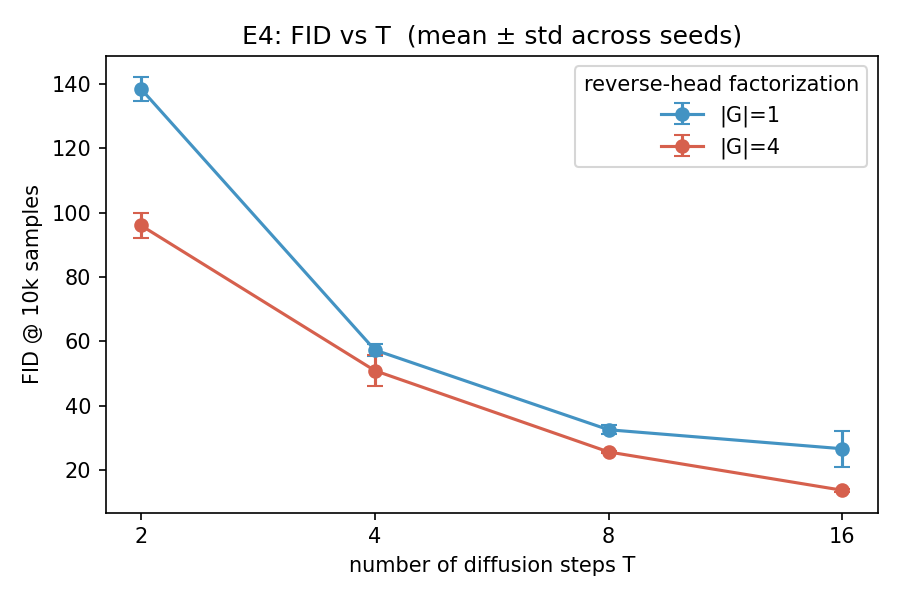
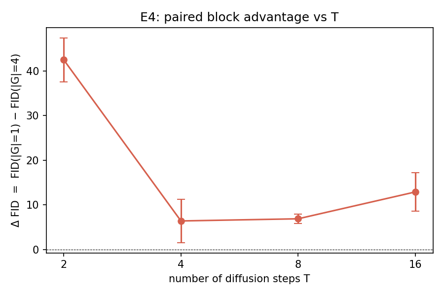
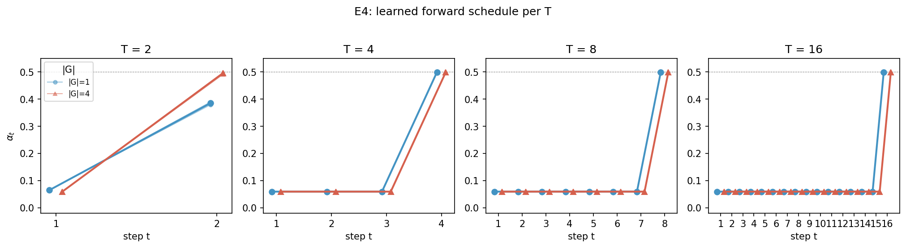

# AML 2026 Project — Block-Factorized Discrete Diffusion

Closing the factorization gap in discrete diffusion via locally-coupled reverse
models. Instead of independent per-pixel predictions, the reverse head emits a
joint distribution over small pixel blocks (|G| ∈ {1, 2, 4}), so within-block
correlations are absorbed by `p_theta` rather than left as an irreducible KL
gap. See `PROBLEMSETTING.md` for the full proposal.

## Setup

```bash
pip install -r requirements.txt
```

## E1 — Synthetic validation (H1)

Each 2×2 block of the synthetic image is i.i.d. from a categorical peaked on
{all-0, all-1, two checkers} with a small uniform noise floor. A pixel-factorized
model can only fit per-pixel marginals (≈ uniform by symmetry) so it cannot
capture the coupling; a 2×2 block head can.

```bash
python run_e1.py --device cuda --epochs 30 --seeds 42 43 44 --block_sizes 1 4
```

Results (T = 4, 3 seeds, ε = 0.04 noise floor; numbers in
`results/results_e1.json`):

| `|G|`     | recon loss (mean ± std) | block-TV to ground truth |
|-----------|-------------------------|--------------------------|
| 1 (pixel) | 1363.05 ± 4.01          | 0.365 ± 0.062            |
| 4 (2×2)   | **1139.85 ± 5.23**      | **0.056 ± 0.004**        |

`block-TV` is the TV distance between the model's induced 16-state block
distribution and the synthetic ground truth. ≈ 6.5× reduction with the block
head; the analytic best-possible TV for a pixel-factorized model on this
dataset is 0.72 (printed by the script for context). **H1 supported.**

## E2 — Block size vs. FID on MNIST (H2)

Binarized MNIST, T = 4. FID computed over 10k MNIST test images vs. 10k
generated samples (pytorch-fid, InceptionV3 dims=2048).

```bash
python run_e2.py --device cuda --epochs 100 --seeds 42 43 44 --block_sizes 1 4
python run_e2.py --device cuda --epochs 100 --seeds 42 43 44 45 46 47 --block_sizes 2
python eval_e2_from_ckpts.py --device cuda                  # re-score saved best.pt's
python merge_e2_stats.py --sources results/results_e2_*.json --bs_a 1 --bs_b 4
```

Results (n = 6 paired seeds: 42–47, 100 epochs each, all three block sizes;
`±` is across-seed sd, not SE of the mean — divide by √6 ≈ 2.45 for SE):

| `|G|`     | ELBO loss (mean ± sd)  | FID @ 10k (mean ± sd)  |
|-----------|------------------------|------------------------|
| 1 (pixel) | 159.31 ± 0.67          | 58.11 ± 2.96           |
| 2 (1×2)   | 142.13 ± 0.46          | 55.63 ± 2.56           |
| 4 (2×2)   | **125.20 ± 0.49**      | **49.08 ± 3.71**       |

ELBO values are the corrected KL form (`results/results_elbo_corrected.json`):
the per-pixel / per-block term is `KL[q‖p_θ] = CE − H[q]`, not the raw
cross-entropy. The earlier 690-nat figures included a constant parasitic
`H[q] ≈ 531 nats/image` (≈ 77 % of the reported value) that is identical across
`|G|` and so cancels in any cross-block comparison — which is why the per-image
gap below is unchanged (159.31 − 125.20 ≈ 34 nats, same as the old 690 − 656).

Bold marks the headline claim (held-out FID); ELBO is intentionally unbolded —
it's monotone by construction (the |G|=4 head is strictly more expressive) and
the gap (≈ 34 nats/image, ≈ 49 bits, ≈ 200× the paired sd of 0.16) just
confirms optimization converged. The scientific claim lives in the FID column.

**FID is monotone in block size.** All three pairwise comparisons (paired by seed):

| pair       | mean Δ FID | paired t | p (1-sided) | Wilcoxon p | bootstrap 95% CI | sign  |
|------------|------------|----------|-------------|------------|------------------|-------|
| 1 vs 2     | +2.48      | 1.44     | 0.105       | 0.109      | [−0.25, +5.87]   | 5/6   |
| 2 vs 4     | +6.55      | 5.61     | 0.001       | 0.016      | [+4.40, +8.51]   | 6/6   |
| **1 vs 4** | **+9.03**  | **3.88** | **0.006**   | **0.031**  | **[+4.79, +13.15]** | 5/6\* |

\* The lone non-positive sign in both 1-vs rows is seed 43 — its |G|=1 model
was an unusually good draw (FID 55.78 vs the other-seed mean of 58.58). The
pattern is in the |G|=1 baseline, not the block models: in 2 vs 4, seed 43 is
positive (Δ = +2.37). With n = 6, the Wilcoxon's smallest reachable p is 1/64
≈ 0.016, which 2 vs 4 hits exactly; 1 vs 4 is one near-tie away from doing
the same.

**Multiple-comparison correction.** Holm correction across the three pairwise
tests (two-sided, the conservative choice; `results/results_e2_holm.json`):
2 vs 4 `p_holm = 0.007` ✓, **1 vs 4 `p_holm = 0.023` ✓**, 1 vs 2
`p_holm = 0.21` ✗. Both comparisons against `|G|=4` survive at α = 0.05; the
1 vs 2 comparison does not, consistent with the raw tests above.

- **The big jump is 2 → 4, not 1 → 2.** Horizontal-only 1×2 blocks help only marginally (CI crosses zero); 2×2 blocks — which capture both horizontal *and* vertical local structure — give the statistically robust win. This is consistent with the TC absorbed by |G|=2 being a strict subset of the TC absorbed by |G|=4.
- **H2 supported** for |G|=4; |G|=2 directionally consistent but underpowered.

Per-seed paired FID differences:

| seed         | 42    | 43    | 44     | 45    | 46     | 47     |
|--------------|-------|-------|--------|-------|--------|--------|
| Δ FID (1−2)  | +0.98 | −2.42 | +0.44  | +3.80 | +2.05  | +10.05 |
| Δ FID (2−4)  | +6.86 | +2.37 | +9.90  | +3.98 | +8.71  | +7.48  |
| Δ FID (1−4)  | +7.83 | −0.05 | +10.34 | +7.79 | +10.75 | +17.53 |

**Seed protocol (disclosure).** Seeds 42–44 (n = 3) were run first; seeds 45–47
were added afterward to increase power. We disclose this because the headline
1-vs-4 comparison strengthened with the added seeds — one-sided paired-t
`p ≈ 0.10` at n = 3, `p ≈ 0.006` at n = 6 — so the analysis is vulnerable to an
optional-stopping reading. To guard against it we (i) report the full per-seed
differences above, (ii) apply Holm family-wise correction at the final n = 6,
and (iii) note that the larger 2-vs-4 effect was already near-significant at
n = 3 (one-sided `p ≈ 0.05`). <!-- TODO(authors): if 45–47 were in fact planned
upfront, state that here and delete the optional-stopping caveat. -->

### Schedule collapse

The learned forward schedule collapses to `α ≈ [0.06, 0.06, 0.06, 0.50]` in
**18 / 18 runs across all three block sizes** — one near-uniformizing jump at
t = T, three weak earlier steps. Identical to four significant figures
regardless of `|G|`.



Two implications:
1. The FID comparison is at the *same* forward process across all three block
   sizes. The block advantage is purely on the reverse parameterization, not
   from co-adapting the forward.
2. The learned schedule on binarized MNIST at T = 4 is degenerate: a near-no-op
   pre-stage followed by one big uniformizing step. This is a property of
   FLDD on this dataset, not of our method, but it bears flagging.

## E3 — Block joint analysis (H3)

For the trained |G|=4 model, measure how far the block-level joint
`p_theta(z_s^G | z_t)` deviates from the product of its per-pixel marginals
(equivalently, the within-block total correlation of the model). Stratified by
the clean image: **background** (all zeros), **mixed** (boundary), **stroke**
(all ones).

```bash
python run_e3.py --device cuda
```

Within-block TC in nats (T = 4, 3 seeds, 2048 test images, mean ± across-seed
sd; "≈ 0" denotes sd < 5 × 10⁻⁵):

| t     | background           | mixed                | stroke               |
|-------|----------------------|----------------------|----------------------|
| 1     | 0.0009 ± ≈ 0         | 0.0133 ± 0.0005      | 0.0072 ± 0.0002      |
| 2     | 0.0003 ± ≈ 0         | 0.0045 ± 0.0002      | 0.0026 ± 0.0003      |
| 3     | 0.0003 ± ≈ 0         | 0.0045 ± 0.0003      | 0.0025 ± 0.0004      |
| **4** | **0.1238 ± 0.0034**  | **0.3894 ± 0.0076**  | **0.4261 ± 0.0079**  |


Mixed / stroke ≫ background at every t — direct evidence the |G|=4 model has
absorbed local within-block correlations exactly where the data has structure.
The signal concentrates at t = T = 4 (largest reverse-step uncertainty); at
small t predictions are near-deterministic so TC ≈ 0 regardless. **H3
supported**, with the framing tightened to "structured vs. homogeneous" rather
than "stroke vs. background" (stroke interiors couple too).


Representative blocks (25/50/75% TC quantile within each category) at t = 4:
the model's 16-d joint vs. the product of its per-pixel marginals, with the
clean 2×2 `x` patch inset. Background blocks: indistinguishable. Mixed and
stroke: clearly non-factorized.

Sanity checks: factorized joints → TC ≈ 0 (< 1e-6 numerically); the
maximally-coupled (50/50 all-0 / all-1) joint → TC = 3 · log 2 ≈ 2.079 (matches
analytic value); |G|=1 has TC ≡ 0 by construction (excluded from the figures).

## E4 — Steps vs. quality (stretch goal)

Sweep T ∈ {2, 4, 8, 16} × |G| ∈ {1, 4} × 3 seeds (42–44). T = 4 row reuses the
E2 checkpoints (100 epochs); other rows trained 80 epochs fresh. FID at 10k.

```bash
python run_e4.py --device cuda --T_values 2 4 8 16 --block_sizes 1 4 \
                 --seeds 42 43 44 --reuse_t4_dir checkpoints_e2
python merge_e4_stats.py                                    # paired stats per T
```

Per-row marginals (mean ± across-seed sd, n = 3):

| T  | FID `|G|=1`   | FID `|G|=4`      |
|----|---------------|------------------|
| 2  | 138.43 ± 3.80 | **95.98 ± 3.74** |
| 4  | 57.27 ± 1.73  | **50.85 ± 4.75** |
| 8  | 32.46 ± 1.44  | **25.56 ± 0.26** |
| 16 | 26.56 ± 5.58  | **13.65 ± 0.48** |

Paired statistics on ΔFID = FID(|G|=1) − FID(|G|=4), per seed (n = 3 each):

| T  | mean Δ FID (paired) | sd Δ | paired t | p (1-sided) | sign |
|----|---------------------|------|----------|-------------|------|
| 2  | **+42.45**          | 6.02 | 12.21    | 0.003       | 3/3  |
| 4  | +6.42               | 5.94 | 1.87     | 0.101       | 2/3  |
| 8  | **+6.90**           | 1.25 | 9.58     | 0.005       | 3/3  |
| 16 | **+12.91**          | 5.33 | 4.20     | 0.026       | 3/3  |

We omit bootstrap CIs here: with only 3³ = 27 distinct resamples the 2.5 / 97.5
quantiles collapse onto the observed min/max and carry no information beyond the
range. With n = 3 the Wilcoxon and exact sign tests also bottom out at p = 0.125
(one-sided support is too small to clear 0.05), so the paired t-test (df = 2) is
the only test with the resolution to reject at this sample size and we report it
alone.




- |G|=4 wins at every T in mean and in 3/3 sign except T=4, where seed 43 is
  a sign-flip (Δ = −0.31) — the same baseline-favoring seed as in E2's 1-vs
  rows. H2 generalizes beyond T = 4.
- Both curves drop monotonically in T as expected.
- The block advantage is largest at T = 2 (Δ ≈ 42), where each reverse step
  must carry more mass and within-block correlations are strongest — the
  pixel-factorized head collapses (FID ≈ 138). This is the mechanism the
  theory predicts: block factorization absorbs local TC precisely where TC is
  large. Gap shrinks to ≈ 6–7 at T ∈ {4, 8} as per-step posteriors soften,
  then widens again at T = 16 (with a noisy |G|=1 std driven by one seed).
- Loss values are not cross-T comparable (loss sums KL over T steps); only
  within-row comparisons are meaningful, where |G|=4 always has lower loss
  as expected from strictly higher expressiveness.
- **Schedule diverges at T = 2.** The learned forward schedule collapses to
  the same near-no-op-then-one-big-jump shape at T ∈ {4, 8, 16} regardless
  of `|G|` (same pattern as in E2). At T = 2 the schedules differ: |G|=4
  reaches α ≈ 0.50 at t = T while |G|=1 only reaches α ≈ 0.38, suggesting
  the pixel-factorized head is forced to keep the forward less destructive
  to retain any chance of reconstruction. The T = 2 FID gap therefore
  conflates a reverse-head effect with a forward-schedule effect — flagging,
  not removing, the claim (block head still wins by ~42 FID points).



## Per-checkpoint FID utility

Ad-hoc evaluation for an individual `best.pt` (mostly for spot-checks; the
E2/E4 sweeps already report FID per run). Example using a real E2 checkpoint:

```bash
python evaluate_fid.py \
    --checkpoint checkpoints_e2/bs4_s42_best.pt \
    --T 4 --n_samples 10000 \
    --real_dir fid_stats/real \
    --gen_dir  fid_stats/spot_check/bs4_s42

# or, if you already have a generated-image dir, score it directly:
python -m pytorch_fid fid_stats/real fid_stats/spot_check/bs4_s42
```

## Project structure

```
fldd/
  data.py            binarized MNIST loading
  synthetic.py       E1 synthetic block-tiled dataset + TV metric
  forward.py         learned forward process (element-wise corruption)
  blocks.py          block reshape / target / index utilities
  unet.py            U-Net reverse model with block output head
  train.py           ELBO loss and training loop
  sample.py          reverse sampling
  block_analysis.py  E3: within-block TC + region classifier

train_synthetic.py     single-run synthetic training
train_mnist.py         single-run MNIST training (exposes run_mnist())
run_e1.py              E1 sweep
run_e2.py              E2 sweep: train + FID + JSON dump
run_e3.py              E3 block-joint analysis (uses |G|=4 ckpts from E2)
run_e4.py              E4 sweep: FID vs T ∈ {2,4,8,16} × |G| ∈ {1,4}
viz_schedule.py        plot learned αₜ from E2 + E4 checkpoints
eval_e2_from_ckpts.py  re-score saved E2 checkpoints
merge_e2_stats.py      paired t / Wilcoxon / sign + bootstrap CI on E2 results
merge_e4_stats.py      same, per T row, on E4 results
evaluate_fid.py        ad-hoc per-checkpoint FID

results/               all results JSONs (results_e[1-4]_*.json, schedule_summary.json)
figures/               all plots (e3_*, e4_*, viz_schedule_e2 in {.png,.pdf})
```
