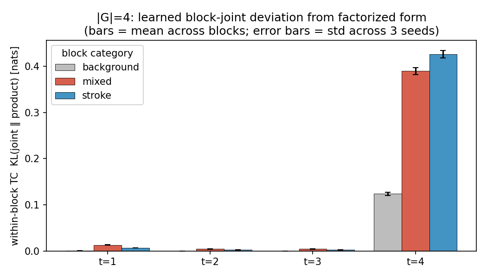
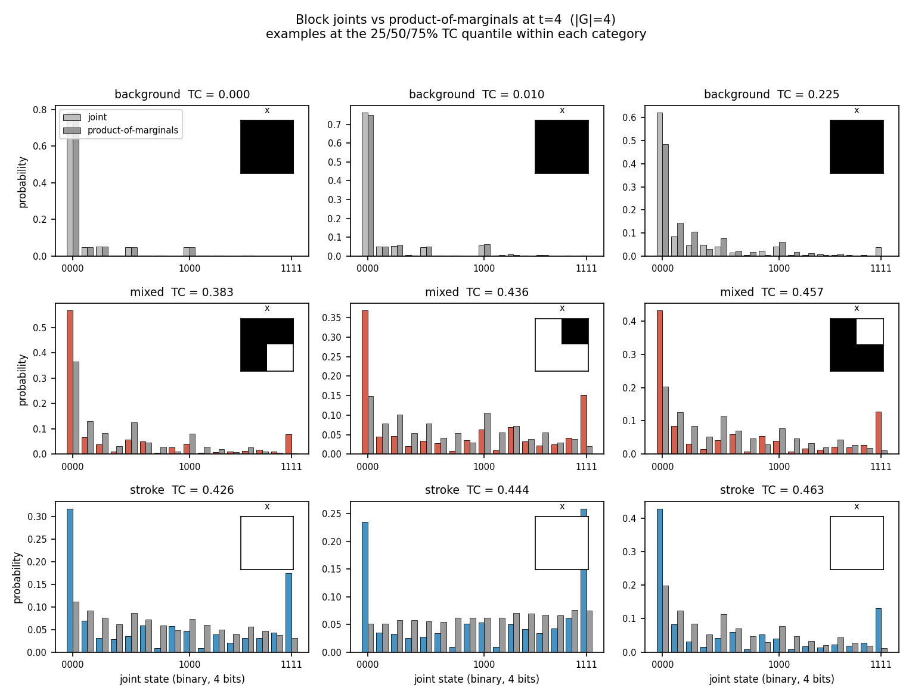

# AML 2026 Project — Block-Factorized Discrete Diffusion

Closing the factorization gap in discrete diffusion via locally-coupled reverse
models. Instead of independent per-pixel predictions, the reverse head emits a
joint distribution over small pixel blocks (|G| ∈ {1, 2, 4}), so within-block
correlations are absorbed by `p_theta` rather than left as an irreducible KL
gap. See `PROBLEMSETTING.md` for the full proposal.

## Setup

```bash
pip install -r requirements.txt
```

## E1 — Synthetic validation (H1)

Each 2×2 block of the synthetic image is i.i.d. from a categorical peaked on
{all-0, all-1, two checkers} with a small uniform noise floor. A pixel-factorized
model can only fit per-pixel marginals (≈ uniform by symmetry) so it cannot
capture the coupling; a 2×2 block head can.

```bash
python run_e1.py --device cuda --epochs 30 --seeds 42 43 44 --block_sizes 1 4
```

Results (T = 4, 3 seeds, ε = 0.04 noise floor):

| `|G|`     | recon loss (mean ± std) | block-TV to ground truth |
|-----------|-------------------------|--------------------------|
| 1 (pixel) | 1363.10 ± 3.13          | 0.378 ± 0.047            |
| 4 (2×2)   | **1139.88 ± 3.93**      | **0.056 ± 0.006**        |

`block-TV` is the TV distance between the model's induced 16-state block
distribution and the synthetic ground truth. ≈ 7× reduction with the block head.
**H1 supported.**

## E2 — Block size vs. FID on MNIST (H2)

Binarized MNIST, T = 4. FID computed over 10k MNIST test images vs. 10k
generated samples (pytorch-fid, InceptionV3 dims=2048).

```bash
python run_e2.py --device cuda --epochs 100 --seeds 42 43 44 --block_sizes 1 4
python eval_e2_from_ckpts.py --device cuda                # re-score saved best.pt's
python merge_e2_stats.py --sources results_e2_*.json      # paired stats
```

Results (n = 6 paired seeds: 42–47, 100 epochs each):

| `|G|`     | ELBO loss (mean ± std) | FID @ 10k (mean ± std) |
|-----------|------------------------|------------------------|
| 1 (pixel) | 690.43 ± 0.71          | 58.11 ± 2.96           |
| 4 (2×2)   | **656.34 ± 0.55**      | **49.08 ± 3.71**       |

- **ELBO:** |G|=4 is 34.09 ± 0.16 nats lower. Paired t = 520.6, p ≈ 0 — overwhelmingly conclusive.
- **FID:** Δ = 9.03 in favor of |G|=4 (5/6 seeds win, one near-tie). Paired t = 3.88, p (one-sided) = 0.006, two-sided = 0.012. Wilcoxon signed-rank p = 0.031. Bootstrap 95% CI on Δ: **[+4.8, +13.2]** — comfortably positive. **H2 supported.**

Per-seed FID (Δ = |G|=1 − |G|=4):

| seed | 42    | 43    | 44     | 45    | 46     | 47     |
|------|-------|-------|--------|-------|--------|--------|
| Δ    | +7.84 | −0.05 | +10.34 | +7.79 | +10.75 | +17.53 |

The learned forward schedule collapses to nearly the same `α = [0.06, 0.06, 0.06, 0.50]` across all 12 runs regardless of block size — one near-uniformizing jump at t = T, three weak earlier steps.

## E3 — Block joint analysis (H3)

For the trained |G|=4 model, measure how far the block-level joint
`p_theta(z_s^G | z_t)` deviates from the product of its per-pixel marginals
(equivalently, the within-block total correlation of the model). Stratified by
the clean image: **background** (all zeros), **mixed** (boundary), **stroke**
(all ones).

```bash
python run_e3.py --device cuda
```

Within-block TC in nats (T = 4, 3 seeds, 2048 test images, mean across blocks):

| t     | background          | mixed               | stroke              |
|-------|---------------------|---------------------|---------------------|
| 1     | 0.0009              | 0.0133              | 0.0072              |
| 2     | 0.0003              | 0.0045              | 0.0026              |
| 3     | 0.0003              | 0.0045              | 0.0025              |
| **4** | **0.124 ± 0.003**   | **0.389 ± 0.008**   | **0.426 ± 0.008**   |



Mixed / stroke ≫ background at every t — direct evidence the |G|=4 model has
absorbed local within-block correlations exactly where the data has structure.
The signal concentrates at t = T = 4 (largest reverse-step uncertainty); at
small t predictions are near-deterministic so TC ≈ 0 regardless. **H3
supported**, with the framing tightened to "structured vs. homogeneous" rather
than "stroke vs. background" (stroke interiors couple too).



Representative blocks (25/50/75% TC quantile within each category) at t = 4:
the model's 16-d joint vs. the product of its per-pixel marginals, with the
clean 2×2 `x` patch inset. Background blocks: indistinguishable. Mixed and
stroke: clearly non-factorized.

Sanity checks: factorized joints → TC ≈ 0 (< 1e-6 numerically); the
maximally-coupled (50/50 all-0 / all-1) joint → TC = 3 · log 2 ≈ 2.079 (matches
analytic value); |G|=1 has TC ≡ 0 by construction (excluded from the figures).

## Per-checkpoint FID utility

```bash
python evaluate_fid.py --checkpoint checkpoints/best.pt --T 4 --n_samples 10000
python -m pytorch_fid fid_stats/real fid_stats/generated
```

## Project structure

```
fldd/
  data.py            binarized MNIST loading
  synthetic.py       E1 synthetic block-tiled dataset + TV metric
  forward.py         learned forward process (element-wise corruption)
  blocks.py          block reshape / target / index utilities
  unet.py            U-Net reverse model with block output head
  train.py           ELBO loss and training loop
  sample.py          reverse sampling
  block_analysis.py  E3: within-block TC + region classifier

train_synthetic.py     single-run synthetic training
train_mnist.py         single-run MNIST training (exposes run_mnist())
run_e1.py              E1 sweep
run_e2.py              E2 sweep: train + FID + JSON dump
run_e3.py              E3 block-joint analysis (uses |G|=4 ckpts from E2)
eval_e2_from_ckpts.py  re-score saved E2 checkpoints
merge_e2_stats.py      paired t / Wilcoxon / sign + bootstrap CI on E2 results
evaluate_fid.py        ad-hoc per-checkpoint FID
```
